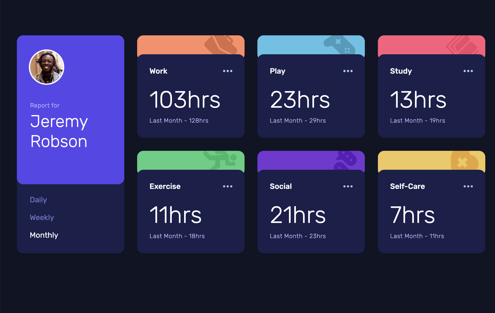

# Frontend - Time tracking dashboard solution

This is a solution to the [Time tracking dashboard challenge on Frontend Mentor] Frontend challenges help you improve your coding skills by building realistic projects.

Users should be able to:

- View the optimal layout for the site depending on their device's screen size

### Screenshot

### Links

- Live Site URL: [https://card-component-erten.netlify.app]

### Built with

- Semantic HTML5 markup
- CSS custom properties
- Flexbox
- CSS Grid
- Mobile-first workflow
- JavaScript
